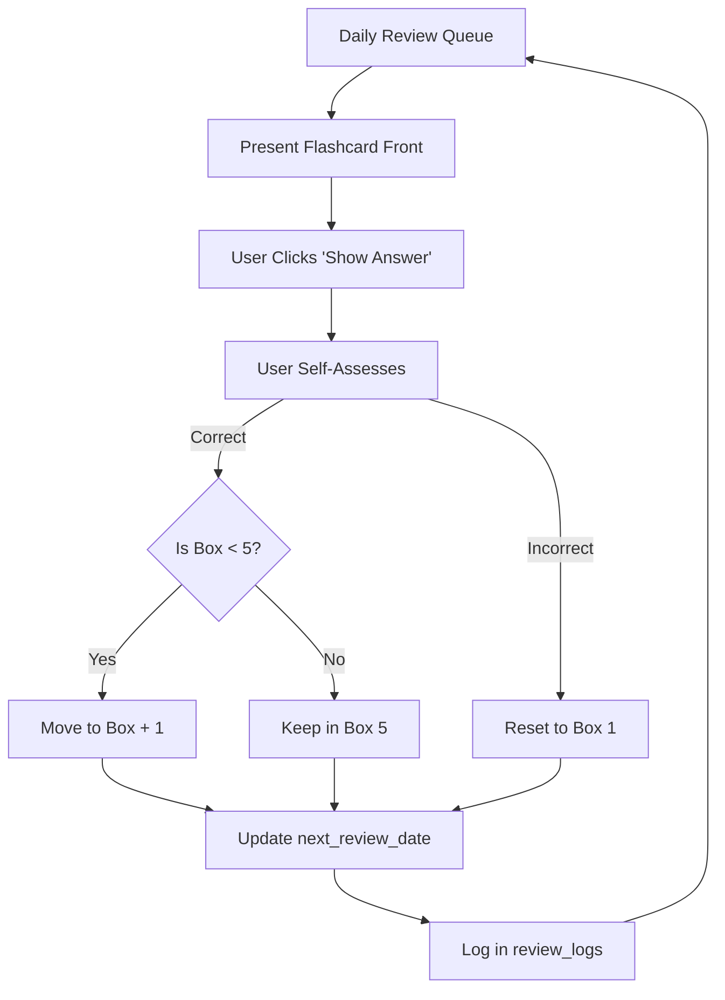
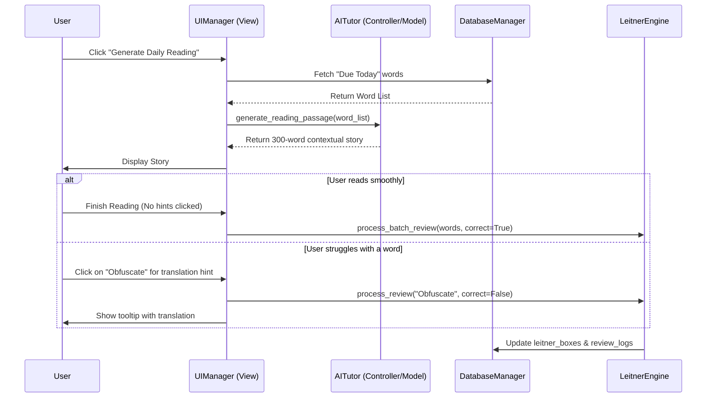

# Technical Design Document: AI-Powered English Learning Hub

## 1. Core Architecture Overview
The application is built using Python with a **Model-View-Controller (MVC)** architectural pattern to ensure clean separation of concerns, maintainability, and scalability. The GUI is powered by **PyQt6**, chosen for its mature, native desktop feel and rich component ecosystem.

*   **Model Layer (Data & Logic)**: Manages the SQLite database, core Leitner system logic, and API integrations. It represents the application's state and business rules.
*   **View Layer (UI)**: PyQt6 widgets and windows. It displays data to the user and captures user inputs. Views are strictly separated from business logic.
*   **Controller Layer (Routing & Interaction)**: Acts as the intermediary. It listens to UI events from the View, calls the appropriate Model functions, and updates the View with the new state.

## 2. Database Schema (SQLite)
The application relies on a local SQLite database for offline-first capability and high performance.

### Tables
*   **`flashcards`**: Core vocabulary data.
    *   `id` (INTEGER PRIMARY KEY)
    *   `word` (TEXT UNIQUE NOT NULL)
    *   `definition` (TEXT)
    *   `translation` (TEXT)
    *   `example_sentence` (TEXT)
    *   `phonetics` (TEXT)
    *   `created_at` (TIMESTAMP)

*   **`ai_metadata`**: AI-generated rich context.
    *   `id` (INTEGER PRIMARY KEY)
    *   `flashcard_id` (INTEGER FOREIGN KEY -> flashcards.id)
    *   `roots_affixes` (TEXT)
    *   `synonyms` (TEXT)
    *   `collocations` (TEXT)
    *   `etymology` (TEXT)

*   **`leitner_boxes`**: Spaced repetition tracking.
    *   `id` (INTEGER PRIMARY KEY)
    *   `flashcard_id` (INTEGER FOREIGN KEY -> flashcards.id)
    *   `current_box` (INTEGER DEFAULT 1) - Valid values: 1 to 5.
    *   `next_review_date` (DATE)
    *   `last_reviewed_date` (DATE)

*   **`review_logs`**: Historical tracking and streak calculation.
    *   `id` (INTEGER PRIMARY KEY)
    *   `flashcard_id` (INTEGER FOREIGN KEY -> flashcards.id)
    *   `review_date` (TIMESTAMP)
    *   `is_correct` (BOOLEAN)
    *   `review_source` (TEXT) - e.g., 'manual', 'reading', 'writing', 'tutor'

### Leitner Intervals
Intervals are mathematically calculated based on the box number:
*   **Box 1**: 1 day (Due immediately tomorrow)
*   **Box 2**: 3 days
*   **Box 3**: 7 days
*   **Box 4**: 14 days
*   **Box 5**: 30 days
*   *Progression rule*: Correct -> Box + 1. Incorrect -> Box 1.

## 3. System Flowcharts

### 3.1. Standard Leitner Progression Logic


### 3.2. AI Active Review Flow (Reading Module)


## 4. Core Classes & Modules

### `DatabaseManager` (Model)
*   `__init__(db_path)`: Initializes SQLite connection and creates tables if they don't exist.
*   `add_word(word_data)`: Inserts a new flashcard.
*   `get_due_cards(date)`: Queries `leitner_boxes` for cards where `next_review_date <= today`.
*   `update_leitner_box(flashcard_id, new_box, next_date)`: Updates scheduling.

### `LeitnerEngine` (Model)
*   `process_review(flashcard_id, is_correct, source)`: Contains the core mathematical logic for the Leitner system. Calculates the new box and the exact `next_review_date` based on the intervals.
*   `get_streak()`: Calculates the user's consecutive study streak from `review_logs`.

### `AITutor` (Model/Integration)
*   `__init__(api_config)`: Sets up the LLM client.
*   `enrich_metadata(word)`: Fetches etymology, synonyms, etc., for a new word.
*   `generate_reading_passage(words)`: Prompts the LLM to write a story using specific words.
*   `evaluate_sentence(word, user_sentence)`: Prompts the LLM to grade user input for grammatical and semantic correctness.
*   `generate_mnemonics(leech_words)`: Creates absurd, memorable stories for failing words.

### `UIManager` (Controller/View)
*   Manages PyQt6 Application state.
*   `switch_view(view_name)`: Handles navigation between Dashboard, Word List, Manual Review, and Active Review modules.
*   Binds UI signals (button clicks) to Controller/Model slots.

## 5. External Integration (.env)
To support both proprietary models (OpenAI/Anthropic) and local self-hosted models (Ollama/LM Studio), the application utilizes a `.env` file loaded via `python-dotenv`.

### Environment Structure
```ini
# .env file
LLM_PROVIDER=openai  # Options: openai, local
LLM_MODEL_NAME=gpt-4o-mini # Or 'llama3' for local
LLM_API_KEY=sk-... # Ignored if using local provider
LLM_BASE_URL=https://api.openai.com/v1 # Change to http://localhost:1234/v1 for LM Studio
```

### Security & Access Logic
1.  The `.env` file is explicitly added to `.gitignore` to prevent secret leakage.
2.  The `AITutor` class reads these variables on initialization.
3.  If `LLM_PROVIDER` is set to `local`, the system ignores the API key and routes all requests to the specified `LLM_BASE_URL`. This satisfies **[REQ_VOC_103]** and **[REQ_VOC_015]**, giving privacy-conscious users total control over their data while maintaining access to all AI features.
